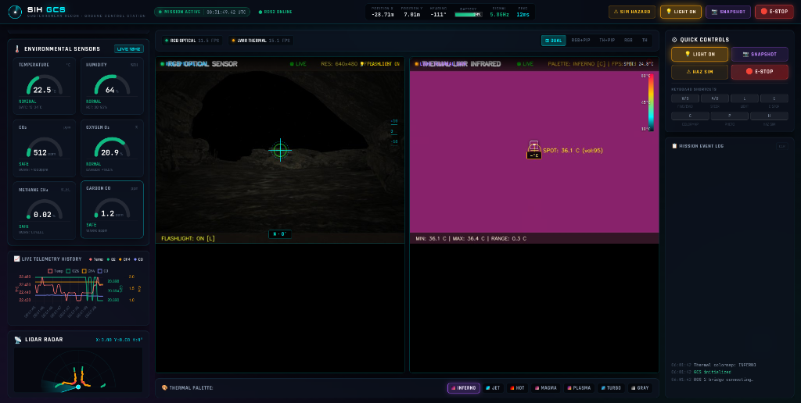
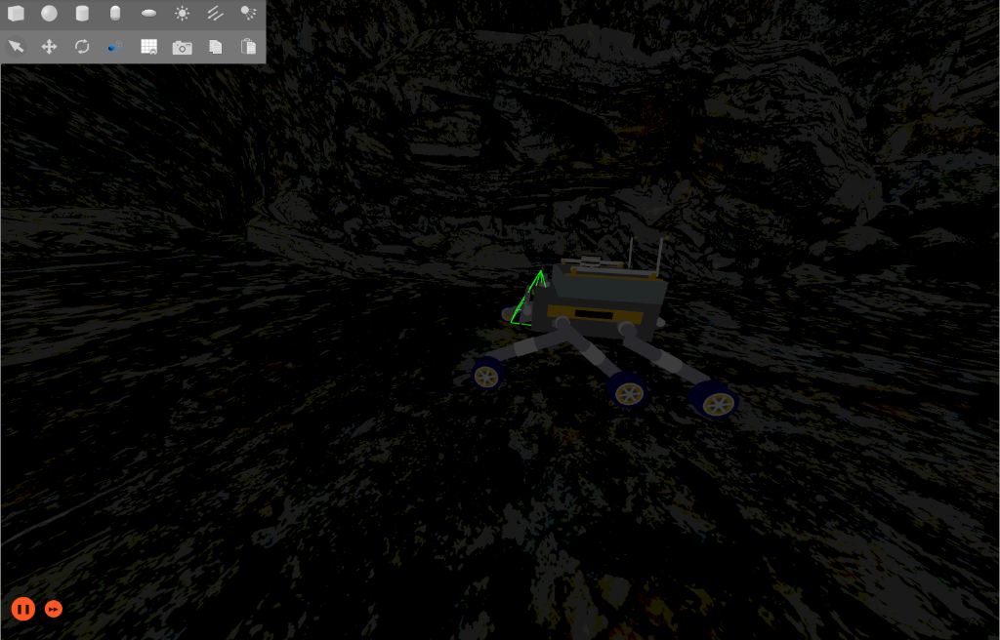
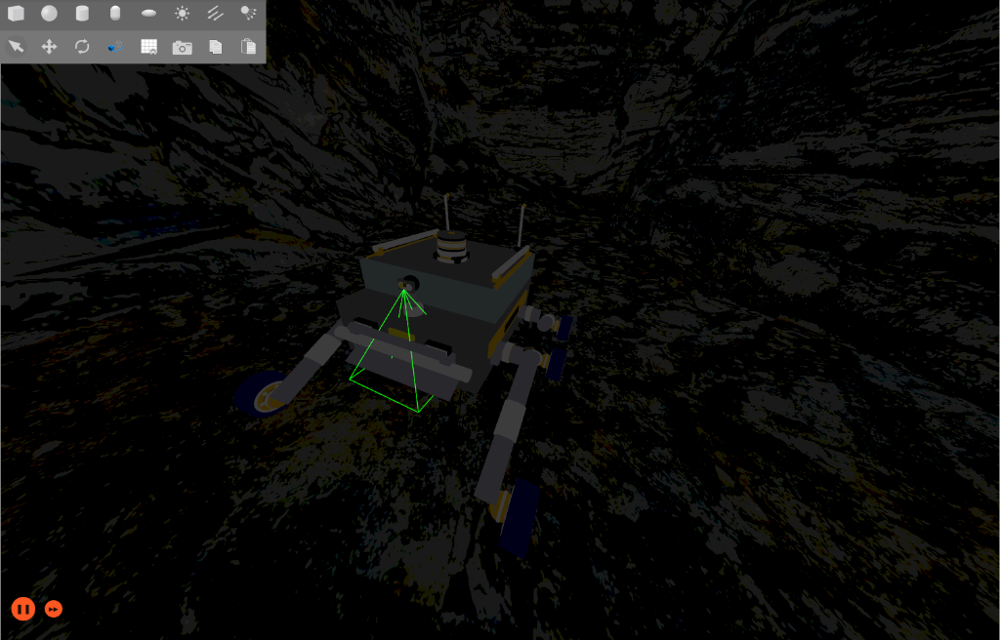
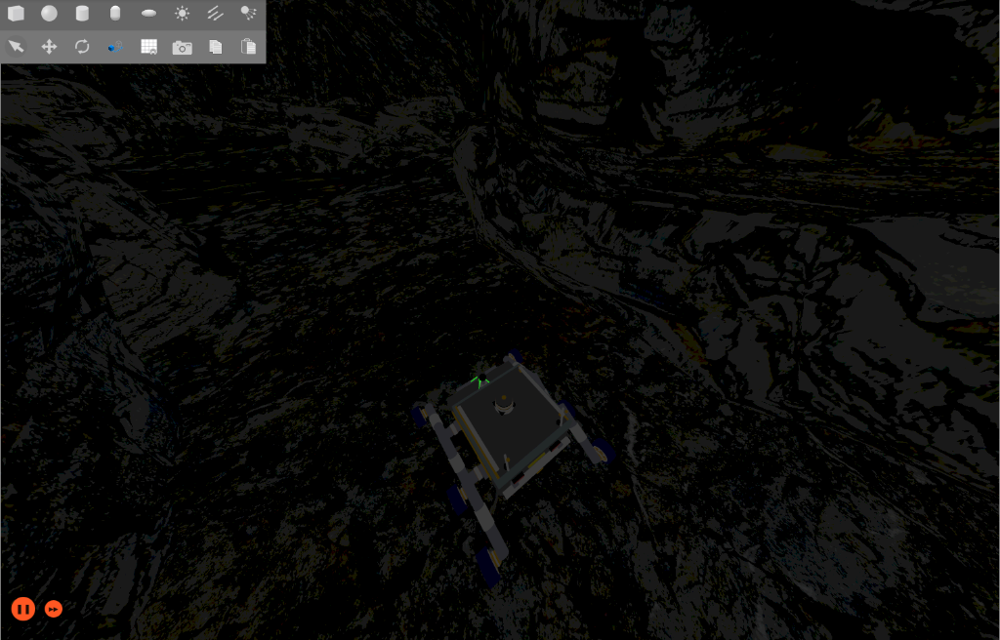
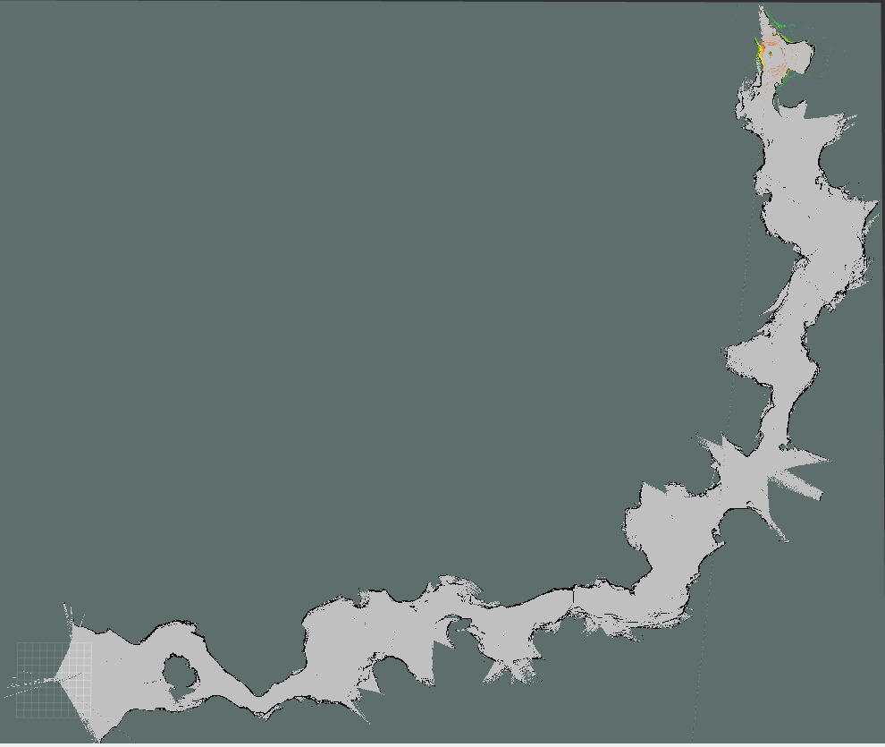

<div align="center">



# 🪨 CAVE DIVER — SIH 2026

### Subterranean Recon & Environmental Monitoring Robot

[](https://docs.ros.org/en/humble/)
[](https://gazebosim.org/)
[](https://www.python.org/)
[](https://flask.palletsprojects.com/)
[](https://opencv.org/)

> **Smart India Hackathon 2026** — Autonomous cave/mine exploration robot with real-time dual-camera inspection, environmental gas sensing, and a full browser-based Ground Control Station (GCS).

</div>

---

## 📋 Table of Contents

- [Overview](#-overview)
- [System Architecture](#-system-architecture)
- [Packages](#-packages)
- [Ground Control Station (GCS)](#-ground-control-station-gcs)
- [Dual Camera System](#-dual-camera-system)
- [Simulation Environment](#-simulation-environment)
- [Cave Map](#-cave-map)
- [Teleop & Control](#-teleop--control)
- [Prerequisites](#-prerequisites)
- [Installation & Build](#-installation--build)
- [Running the System](#-running-the-system)
- [ROS 2 Topics Reference](#-ros-2-topics-reference)
- [GCS REST API](#-gcs-rest-api)
- [Project Structure](#-project-structure)
- [Team](#-team)

---

## 🔍 Overview

**CAVE DIVER** is a ground robot system designed to operate in GPS-denied, hazardous subterranean environments such as caves, mines, and tunnels. Built for **Smart India Hackathon 2026**, it provides:

- 🎥 **Real-time dual camera inspection** — RGB optical + LWIR thermal infrared with tactical HUD
- 🧪 **Environmental hazard monitoring** — Temperature, Humidity, CO₂, O₂, CH₄, CO levels
- 🖥 **Browser-based Ground Control Station** — full tactical dashboard accessible from any laptop
- 🕹 **Autonomous + manual teleoperation** — PS2/Xbox controller via `joy_teleop_simulation`
- 📡 **LiDAR-based scanning** — real-time radar sweep display in GCS
- 🔖 **QR code-based landmark system** — for mine section identification
- 💡 **Flashlight control** — hardware-synchronized tactical spotlight with Gazebo lighting

---

## 🏗 System Architecture

```
┌─────────────────────────────────────────────────────────────────┐
│                      CAVE DIVER System                          │
│                                                                 │
│  ┌───────────────────┐   gz_bridge    ┌──────────────────────┐  │
│  │  Ignition Gazebo  │◄──────────────►│    GCS Server        │  │
│  │  simple_cave_01   │                │  Flask + ROS 2 Node  │  │
│  │                   │  /camera/..    │   gcs_server.py      │  │
│  │  • Armo_bot URDF  │  /thermal/..  └──────────┬───────────┘  │
│  │  • Cave SDF world │  /scan                   │              │
│  │  • LiDAR, IMU     │  /odom                   │ HTTP/MJPEG   │
│  │  • RGB + Thermal  │  /cmd_vel (←)            ▼              │
│  │    cameras        │                ┌──────────────────────┐  │
│  └──────────┬────────┘                │  Browser GCS UI      │  │
│             │                         │  http://localhost:5001│  │
│  ┌──────────▼────────┐                │                      │  │
│  │  Joy Teleop Node  │                │  • Dual camera feeds  │  │
│  │  (PS2 / Xbox)     │ → /cmd_vel     │  • Sensor gauges      │  │
│  └───────────────────┘                │  • LiDAR radar        │  │
│                                       │  • Flashlight toggle  │  │
│                                       └──────────────────────┘  │
└─────────────────────────────────────────────────────────────────┘
```

### Data Flow

| Source | Topic | Type | Consumer |
|--------|-------|------|----------|
| Gazebo Camera | `/camera/image_raw` | `sensor_msgs/Image` | GCS (MJPEG stream) |
| Gazebo Thermal | `/thermal/image_raw` | `sensor_msgs/Image` | GCS (MJPEG stream) |
| Gazebo LiDAR | `/scan` | `sensor_msgs/LaserScan` | GCS (radar display) |
| Gazebo Odometry | `/odom` | `nav_msgs/Odometry` | GCS (telemetry X/Y/Yaw) |
| GCS / Teleop | `/cmd_vel` | `geometry_msgs/Twist` | Gazebo (robot motion) |
| GCS | `/camera_flashlight/switch` | `std_msgs/Bool` | Flashlight controller |

---

## 📦 Packages

| Package | Type | Description |
|---------|------|-------------|
| `simulation` | CMake / ROS 2 | Robot URDF (Armo_bot), SDF cave world, launch files, RViz config, Gazebo bridge config |
| `joy_teleop_simulation` | Python / ROS 2 | PS2/Xbox joystick teleop node with camera gimbal control |
| `GCS` | Flask + Python | Web-based Ground Control Station server (standalone — no `colcon` needed) |
| `scripts` | Python | Standalone ROS 2 desktop camera viewer (`view_dual_camera.py`) |
| `maps` | Data | Pre-built cave occupancy map (`.pgm` + `.yaml`) for SLAM |

---

## 🖥 Ground Control Station (GCS)

The GCS is a **fully browser-based tactical dashboard** built with Flask (backend) and vanilla HTML/CSS/JS (frontend). It runs on your laptop and bridges directly to the ROS 2 network.

<div align="center">

<br/><em>Live GCS Dashboard — Dual camera feeds, environmental sensors, LiDAR radar, telemetry bar & quick controls</em>
</div>

### Features

| Feature | Details |
|---------|---------|
| 📷 **RGB Camera Stream** | Live MJPEG at 640×480 with tactical HUD — crosshair, FPS counter, LIVE heartbeat |
| 🌡 **Thermal IR Stream** | False-color LWIR — 7 colormaps: INFERNO, JET, HOT, MAGMA, PLASMA, TURBO, GRAY |
| 💡 **Flashlight Control** | One-click toggle synchronized with Gazebo `light_config` + radial Gaussian beam boost |
| 🧪 **Environmental Sensors** | Live ring gauges — Temperature, Humidity, CO₂ (ppm), O₂ (%), CH₄ (%), CO — color-coded safe/warning/danger |
| 📡 **Telemetry Bar** | Real-time X, Y position (m), Heading (°), battery, ping |
| 🔄 **LiDAR Radar** | Animated sweep from live `/scan` data |
| 📈 **Telemetry History Chart** | Rolling graph of all 6 sensor channels |
| 📝 **Mission Event Log** | Timestamped log of system events |
| 📸 **Snapshot Capture** | Save current frame to `/GCS/captures/` |
| 🎨 **Colormap Cycle** | Switch thermal palette with one click |
| 🌐 **Standalone Mode** | Works without ROS 2 — synthetic data for UI development |

### GCS Quick Start

```bash
# 1. Install dependencies (one-time only)
pip install flask opencv-python numpy

# 2. Launch GCS
cd GCS
python3 launch_gcs.py

# 3. Open in any browser
# → http://localhost:5001
```

**Custom host/port:**
```bash
python3 launch_gcs.py --host 0.0.0.0 --port 8080
```

---

## 📷 Dual Camera System

The GCS serves both cameras as MJPEG streams with full OpenCV HUD overlays. The same pipeline is also available as a standalone desktop viewer.

**RGB Optical HUD elements:**
- `● LIVE` — blinking green heartbeat
- `RES: 640×480 | FPS: 20.0` — stream diagnostics
- Center crosshair with circle reticle
- `FLASHLIGHT: ON/OFF` status

**Thermal LWIR HUD elements:**
- Active palette name & FPS
- `SPOT: XX.X °C` — center-pixel temperature reading
- `MIN / MAX / RANGE` — full-frame thermal stats
- 🔴 Red reticle = hottest point · 🟡 Yellow = coldest point

### Desktop Viewer (requires ROS 2)

```bash
source /opt/ros/humble/setup.bash
source ~/sih/install/setup.bash
python3 scripts/view_dual_camera.py
```

**Hotkeys:**

| Key | Action |
|-----|--------|
| `L` | Toggle flashlight ON/OFF |
| `C` | Cycle thermal colormap |
| `S` | Save snapshot (RGB + Thermal) |
| `W` | Toggle split / unified window |
| `Q` / `ESC` | Quit |

### Flashlight Beam Algorithm

A radial Gaussian spotlight is applied multiplicatively per channel for natural illumination:

```python
boosted[:, :, 0] *= (1.0 + beam * 1.2)  # Blue
boosted[:, :, 1] *= (1.0 + beam * 1.4)  # Green
boosted[:, :, 2] *= (1.0 + beam * 1.5)  # Red
```

---

## 🌍 Simulation Environment

The robot is simulated inside a custom Ignition Gazebo cave world with realistic rocky terrain.

<div align="center">

| Robot — Wide View | Robot — Close View |
|:-----------------:|:------------------:|
|  |  |

| Robot — Top View | Cave Map (RViz) |
|:----------------:|:---------------:|
|  |  |

</div>

### World: `simple_cave_01.sdf`

A custom SDF world simulating a mine/cave:
- Narrow irregular rock tunnel passages
- Multi-section layout with winding paths
- QR code landmarks placed on walls throughout
- Configurable spot lighting for flashlight testing
- LiDAR, RGB camera, and thermal (grayscale) plugins baked in

### Robot: `Armo_bot`

Defined in `simulation/urdf_sih/` via URDF/Xacro:

| File | Description |
|------|-------------|
| `robot_base.urdf.xacro` | Top-level robot definition |
| `base_mobile.xacro` | Differential drive chassis, wheel geometry |
| `common_properties.xacro` | Shared material & inertia macros |
| `robot_gazebo.xacro` | Gazebo plugins — diff drive, IMU, LiDAR, cameras, flashlight |

### Launch Simulation

```bash
source /opt/ros/humble/setup.bash
source ~/sih/install/setup.bash
ros2 launch simulation test_cave.launch.xml
```

### Gazebo ↔ ROS 2 Bridge

```bash
ros2 run ros_gz_bridge parameter_bridge \
  --ros-args -p config_file:=$(ros2 pkg prefix simulation)/share/simulation/config/gazebo_bridge.yaml
```

### RViz Visualization

```bash
ros2 launch simulation display_sih_map.launch.xml
```

---

## 🗺 Cave Map

<div align="center">

<br/><em>Pre-built occupancy map of the cave — generated via SLAM Toolbox</em>
</div>

The pre-built map (`maps/Cave_map.pgm`) covers the full `simple_cave_01` world:

| Parameter | Value |
|-----------|-------|
| Resolution | `0.05 m/px` |
| Origin | `[-88.8, -22.5, 0]` |
| Occupied Threshold | `0.65` |
| Free Threshold | `0.25` |
| Mode | `Trinary` |

---

## 🕹 Teleop & Control

### Joy Teleop Node

```bash
ros2 launch joy_teleop_simulation teleop_sim.launch.py
```

**PS2/Xbox Button Mapping:**

| Control | Input |
|---------|-------|
| Drive Forward / Backward | Left Stick Up/Down (Axis 1) |
| Turn Left / Right | Right Stick Left/Right (Axis 2) |
| Camera Yaw Left | X Button (3) |
| Camera Yaw Right | B Button (1) |
| Camera Pitch Up | Y Button (4) |
| Camera Pitch Down | A Button (0) |
| Flashlight Toggle | Select (Button 8) |
| Emergency Stop | Start (Button 9) |

### Simulation vs Real Robot

```bash
# Simulation (default)
ros2 launch joy_teleop_simulation teleop_sim.launch.py

# Real robot hardware
ros2 run joy_teleop_simulation teleop_node --ros-args -p use_sim:=false
```

---

## 📋 Prerequisites

**System:**
- OS: Ubuntu 22.04 (recommended)
- RAM: 8 GB minimum, 16 GB recommended
- GPU: Hardware acceleration recommended for Gazebo

**Software:**

```bash
# ROS 2 Humble
sudo apt install ros-humble-desktop

# Ignition Gazebo 6 (Fortress)
sudo apt install ignition-fortress

# ROS-GZ Bridge
sudo apt install ros-humble-ros-gz-bridge ros-humble-ros-gz-sim

# SLAM & Nav2
sudo apt install ros-humble-slam-toolbox ros-humble-navigation2 ros-humble-nav2-bringup

# CV Bridge & Image Transport
sudo apt install ros-humble-cv-bridge ros-humble-image-transport

# Joystick
sudo apt install ros-humble-joy

# GCS Python deps
pip install flask opencv-python numpy
```

---

## 🚀 Installation & Build

```bash
# 1. Clone
git clone https://github.com/Humobot1812/CAVE_DIVER_SIH_2026.git
cd CAVE_DIVER_SIH_2026

# 2. Install ROS 2 dependencies
rosdep install --from-paths . --ignore-src -r -y

# 3. Build
colcon build --symlink-install

# 4. Source
source install/setup.bash
```

---

## ▶️ Running the System

### Full Stack (Recommended Order)

**Terminal 1 — Ignition Gazebo:**
```bash
source /opt/ros/humble/setup.bash && source install/setup.bash
ros2 launch simulation test_cave.launch.xml
```

**Terminal 2 — ROS-GZ Bridge:**
```bash
source /opt/ros/humble/setup.bash && source install/setup.bash
ros2 run ros_gz_bridge parameter_bridge \
  --ros-args -p config_file:=simulation/config/gazebo_bridge.yaml
```

**Terminal 3 — Joystick Teleop:**
```bash
source /opt/ros/humble/setup.bash && source install/setup.bash
ros2 launch joy_teleop_simulation teleop_sim.launch.py
```

**Terminal 4 — GCS (no ROS source needed):**
```bash
cd GCS
python3 launch_gcs.py
# Open → http://localhost:5001
```

**Optional — Desktop Camera Viewer:**
```bash
source /opt/ros/humble/setup.bash && source install/setup.bash
python3 scripts/view_dual_camera.py
```

---

## 📡 ROS 2 Topics Reference

| Topic | Type | Direction | Description |
|-------|------|-----------|-------------|
| `/camera/image_raw` | `sensor_msgs/Image` | GZ → ROS | RGB optical camera |
| `/thermal/image_raw` | `sensor_msgs/Image` | GZ → ROS | Thermal infrared (grayscale) |
| `/scan` | `sensor_msgs/LaserScan` | GZ → ROS | 2D LiDAR scan |
| `/scan/points` | `sensor_msgs/PointCloud2` | GZ → ROS | 3D point cloud |
| `/imu` | `sensor_msgs/Imu` | GZ → ROS | IMU |
| `/odom` | `nav_msgs/Odometry` | GZ → ROS | Robot odometry (X, Y, Yaw) |
| `/tf` | `tf2_msgs/TFMessage` | GZ → ROS | Transform tree |
| `/cmd_vel` | `geometry_msgs/Twist` | ROS → GZ | Velocity commands |
| `/camera_flashlight/switch` | `std_msgs/Bool` | ROS → GZ | Flashlight toggle |
| `/camera_flashlight/status` | `std_msgs/Bool` | GZ → ROS | Flashlight state |
| `/camera_base_cylinder/cmd_pos` | `std_msgs/Float64` | ROS → GZ | Camera yaw joint |
| `/camera_cylinder_sphere/cmd_pos` | `std_msgs/Float64` | ROS → GZ | Camera pitch joint |
| `/camera/gimbal_yaw` | `std_msgs/Float32` | ROS | Gimbal yaw command |
| `/camera/gimbal_pitch` | `std_msgs/Float32` | ROS | Gimbal pitch command |

---

## 🌐 GCS REST API

| Endpoint | Method | Description |
|----------|--------|-------------|
| `/` | `GET` | GCS dashboard HTML |
| `/stream/rgb` | `GET` | MJPEG RGB camera stream |
| `/stream/thermal` | `GET` | MJPEG thermal IR stream |
| `/api/telemetry` | `GET` | JSON: position, sensors, lidar ranges |
| `/api/flashlight` | `POST` | `{"state": true/false}` — toggle flashlight |
| `/api/move` | `POST` | `{"linear": 0.5, "angular": 0.0}` — velocity cmd |
| `/api/colormap` | `POST` | `{"name": "INFERNO"}` — set thermal colormap |
| `/api/snapshot` | `POST` | Capture & save current camera frame |
| `/api/log` | `GET` | Fetch recent mission log entries |

**Example:**
```bash
curl -X POST http://localhost:5001/api/flashlight \
  -H "Content-Type: application/json" \
  -d '{"state": true}'
```

---

## 📁 Project Structure

```
.
├── README.md
├── docs/
│   └── images/
│       ├── gcs_dashboard.png        ← Real GCS screenshot
│       ├── robot_cave_wide.png      ← Armo_bot in cave (wide)
│       ├── robot_cave_close.png     ← Armo_bot in cave (close, camera frustum)
│       ├── robot_cave_top.png       ← Armo_bot top-down view
│       └── cave_map_rviz.png        ← RViz occupancy map
│
├── GCS/
│   ├── gcs_server.py               ← Flask + ROS 2 backend
│   ├── launch_gcs.py               ← Launcher with dep checks
│   ├── captures/                   ← Snapshot save dir
│   ├── templates/index.html        ← GCS dashboard UI
│   └── static/
│       ├── css/gcs_theme.css       ← Dark tactical CSS theme
│       └── js/gcs_app.js           ← Telemetry polling & stream logic
│
├── simulation/
│   ├── package.xml / CMakeLists.txt
│   ├── config/
│   │   ├── gazebo_bridge.yaml      ← ROS ↔ Gazebo bridge config
│   │   └── Slam_param.yaml         ← SLAM Toolbox parameters
│   ├── launch/
│   │   ├── test_cave.launch.xml    ← Main simulation launch
│   │   ├── display.launch.xml
│   │   └── display_sih_map.launch.xml
│   ├── urdf_sih/
│   │   ├── robot_base.urdf.xacro
│   │   ├── base_mobile.xacro
│   │   ├── common_properties.xacro
│   │   └── robot_gazebo.xacro
│   ├── rviz/rviz_config.rviz
│   └── world/
│       ├── simple_cave_01.sdf
│       └── materials/
│           ├── meshes/             ← Landmark STL (hexagon, square, triangle…)
│           └── textures/           ← QR code PNGs for 60+ landmark positions
│
├── joy_teleop_simulation/
│   ├── joy_teleop_simulation/teleop_node.py
│   └── launch/teleop_sim.launch.py
│
├── maps/
│   ├── Cave_map.pgm
│   └── Cave_map.yaml
│
└── scripts/
    └── view_dual_camera.py         ← Standalone desktop camera viewer
```

---

## 🔖 QR Landmark System

60+ QR code textures are embedded on cave walls for GPS-free localization:

```
Format : WH-{Area}-{Room}-{Rack}-{Section}-{Position}
Example: WH-A1-R1-RK1-S1-P1
```

Each landmark encodes the exact mine section. An onboard QR decoder node can parse these to provide absolute position references without GPS.

---

## 👥 Team

**Team: CAVE DIVER** — Smart India Hackathon 2026

| Role | Member |
|------|--------|
| Robot Software, GCS, Simulation & Control | Abhinav |

📧 ironman18122004@gmail.com  
🔗 [github.com/Humobot1812/CAVE_DIVER_SIH_2026](https://github.com/Humobot1812/CAVE_DIVER_SIH_2026)

---

## 📄 License

Developed for Smart India Hackathon 2026. All rights reserved.

---

<div align="center">

**Built with ❤️ for SIH 2026**

*ROS 2 Humble · Ignition Gazebo 6 · OpenCV · Flask · Python 3.10*

</div>
